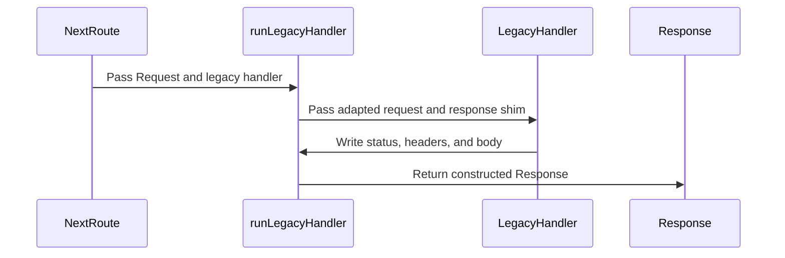

<!-- This is an auto-generated comment: summarize by coderabbit.ai -->
<!-- review_stack_entry_start -->

Navigate logical layers of code changes, visualize relationships, and explore their blast radius.

<!-- review_stack_entry_end -->
<!-- This is an auto-generated comment: rate limited by coderabbit.ai -->

> [!WARNING]
> ## Review limit reached
> 
> **Next included review available in 50 minutes.**
> 
> [Check out review usage here](https://app.coderabbit.ai/dashboard/review-capacity?orgId=a163b6bb-577b-41fc-9316-9facd273ccb9).
> 
> 

> 
View limit details

> 
> **Limit details:** You’ve used the included review currently available.
> 
> You've used all free OSS reviews for now. Wait for the free limit to reset to keep reviewing this public repository.
> 
> [Learn how review limits work](https://docs.coderabbit.ai/management/plans#rate-limits).
> 
> **Review configuration:**
> 
> 

> 
⚙️ Run configuration

> 
> **Configuration used**: Organization UI
> 
> **Review profile**: ASSERTIVE
> 
> **Plan**: Advanced
> 
> **Run ID**: `e93575ff-ee8f-4e5e-b421-093c715c26a3`
> 
> 

> 
> 

> 
📥 Commits

> 
> Reviewing files that changed from the base of the PR and between facaf0cce04d654f952bfea6d2c9a7f9c850ff7e and 3539bf16b72995565ef29df553a2599a7588e048.
> 
> 

> 
> 

> 
📒 Files selected for processing (3)

> 
> * `certify_gates.ts`
> * `harvest.ts`
> * `trends.ts`
> 
> 

> 
> 

<!-- end of auto-generated comment: rate limited by coderabbit.ai -->

<!-- walkthrough_start -->

## Walkthrough

The changes update the GLM provider list and payment product-index lookup. They also add a Next.js workspace with app setup and API routes that adapt requests for existing billing and e-sign handlers.

### Changes

**Provider Configuration**

|Layer / File(s)|Summary|
|---|---|
|**Update GLM provider list**   `opencode.json`|The provider order and allowed-provider list replace `morph` and `together` with `modal`, `decart`, and `gmicloud`. `baseten` remains in both lists.|

**Payments Product Index**

|Layer / File(s)|Summary|
|---|---|
|**Select product index directory**   `payments/src/webhook_core.ts`|`loadProductIndex` checks `PAYMENTS_CONFIG_DIR`, the module-relative directory, `cwd/payments`, and `cwd/../payments` in order. It selects the first directory with a matching configuration file or falls back to the first candidate.|

**Next.js Web Workspace**

|Layer / File(s)|Summary|
|---|---|
|**Configure web workspace**   `pnpm-workspace.yaml`, `web/package.json`, `web/tsconfig.json`, `web/eslint.config.mjs`, `web/postcss.config.mjs`, `web/next.config.ts`, `web/.gitignore`|The repository adds the `web` workspace, package scripts, compiler and lint settings, Next.js and PostCSS configuration, build permissions, and ignore rules.|
|**Add root app shell and theme**   `web/app/layout.tsx`, `web/app/globals.css`, `web/src/design/tokens.ts`|The root layout defines metadata, viewport settings, and document structure. Global styles and design tokens define palette colors and typography settings.|
|**Adapt requests for legacy API handlers**   `web/app/api/_legacy/shim.ts`, `web/app/api/billing/checkout/route.ts`, `web/app/api/billing/webhook/route.ts`, `web/app/api/esign/create/route.ts`, `web/app/api/esign/webhook/route.ts`, `web/api/billing/webhook.ts`, `web/api/esign/create.ts`, `web/api/esign/webhook.ts`|The adapter maps Next.js requests and legacy response writes to a `Response`. Billing and e-sign routes delegate to existing handlers. The handlers convert caught values to message strings.|

<!-- change_assessment_start -->

**Estimated code review effort:** 3 (Moderate) | ~20 minutes

<!-- change_assessment_commit:"facaf0cce04d654f952bfea6d2c9a7f9c850ff7e" -->
**Change:** Feature
<!-- change_assessment_end -->

### Sequence Diagram(s)

<!-- walkthrough_end -->
<!-- pre_merge_checks_walkthrough_start -->

🚥 Pre-merge checks | ✅ 4 | ❌ 1

### ❌ Failed checks (1 warning)

|     Check name     | Status     | Explanation                                                                                                                                                                                 | Resolution                                                                         |
| :----------------: | :--------- | :------------------------------------------------------------------------------------------------------------------------------------------------------------------------------------------ | :--------------------------------------------------------------------------------- |
| Docstring Coverage | ⚠️ Warning | Docstring coverage is 0.00% which is insufficient. The required threshold is 80.00%. Docstring coverage is scoped to functions touched by this diff. Analyzed 11 functions across 14 files. | Write docstrings for the functions missing them to satisfy the coverage threshold. |

✅ Passed checks (4 passed)

|         Check name         | Status   | Explanation                                                                                                              |
| :------------------------: | :------- | :----------------------------------------------------------------------------------------------------------------------- |
|      Description Check     | ✅ Passed | Check skipped - CodeRabbit’s high-level summary is enabled.                                                              |
|         Title check        | ✅ Passed | The title clearly summarizes the main changes: a Next.js scaffold with URL-preserving rewrites and bridged API handlers. |
|     Linked Issues check    | ✅ Passed | Check skipped because no linked issues were found for this pull request.                                                 |
| Out of Scope Changes check | ✅ Passed | Check skipped because no linked issues were found for this pull request.                                                 |

<!-- pre_merge_checks_walkthrough_end -->
<!-- finishing_touch_checkbox_start -->

✨ Finishing Touches 💡 1

<!-- finishing_touch_suggestion:docstrings -->

📝 Generate docstrings 💡

- [ ] <!-- {"checkboxId":"3e1879ae-f29b-4d0d-8e06-d12b7ba33d98"} --> Commit to this branch
- [ ] <!-- {"checkboxId":"7962f53c-55bc-4827-bfbf-6a18da830691"} --> Create a new PR

🧪 Generate unit tests (beta)

- [ ] <!-- {"checkboxId": "6ba7b810-9dad-11d1-80b4-00c04fd430c8", "radioGroupId": "utg-output-choice-group-unknown_comment_id"} --> Commit to this branch
- [ ] <!-- {"checkboxId": "f47ac10b-58cc-4372-a567-0e02b2c3d479", "radioGroupId": "utg-output-choice-group-unknown_comment_id"} --> Create a new PR

✨ Simplify code

- [ ] <!-- {"checkboxId": "9a4e3077-58f6-4eba-b7ee-62e936ea00ea", "radioGroupId": "simplify-output-choice-group-unknown_comment_id"} --> Commit to this branch
- [ ] <!-- {"checkboxId": "f120d606-b0e2-4b7d-8316-181794555b43", "radioGroupId": "simplify-output-choice-group-unknown_comment_id"} --> Create a new PR

<!-- finishing_touch_checkbox_end -->
<!-- tips_start -->

---

Thanks for using [CodeRabbit](https://coderabbit.ai?utm_source=oss&utm_medium=github&utm_campaign=Hex-Tech-Lab/hex-expan-press&utm_content=1)! It's free for OSS, and your support helps us grow. If you like it, consider giving us a shout-out.

❤️ Share

- [X](https://twitter.com/intent/tweet?text=I%20just%20used%20%40coderabbitai%20for%20my%20code%20review%2C%20and%20it%27s%20fantastic%21%20It%27s%20free%20for%20OSS%20and%20offers%20a%20free%20trial%20for%20the%20proprietary%20code.%20Check%20it%20out%3A&url=https%3A//coderabbit.ai)
- [Mastodon](https://mastodon.social/share?text=I%20just%20used%20%40coderabbitai%20for%20my%20code%20review%2C%20and%20it%27s%20fantastic%21%20It%27s%20free%20for%20OSS%20and%20offers%20a%20free%20trial%20for%20the%20proprietary%20code.%20Check%20it%20out%3A%20https%3A%2F%2Fcoderabbit.ai)
- [Reddit](https://www.reddit.com/submit?title=Great%20tool%20for%20code%20review%20-%20CodeRabbit&text=I%20just%20used%20CodeRabbit%20for%20my%20code%20review%2C%20and%20it%27s%20fantastic%21%20It%27s%20free%20for%20OSS%20and%20offers%20a%20free%20trial%20for%20proprietary%20code.%20Check%20it%20out%3A%20https%3A//coderabbit.ai)
- [LinkedIn](https://www.linkedin.com/sharing/share-offsite/?url=https%3A%2F%2Fcoderabbit.ai&mini=true&title=Great%20tool%20for%20code%20review%20-%20CodeRabbit&summary=I%20just%20used%20CodeRabbit%20for%20my%20code%20review%2C%20and%20it%27s%20fantastic%21%20It%27s%20free%20for%20OSS%20and%20offers%20a%20free%20trial%20for%20proprietary%20code)

Comment `@coderabbitai help` to get the list of available commands.

<!-- tips_end -->
